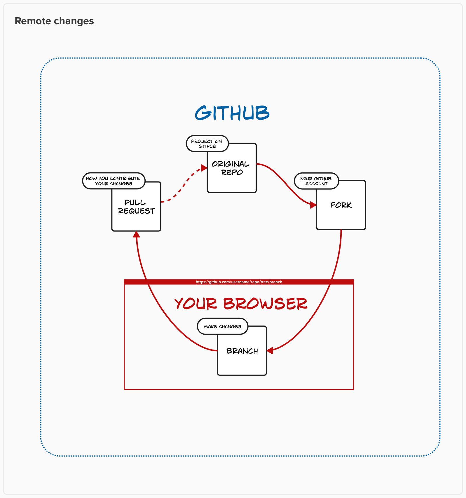
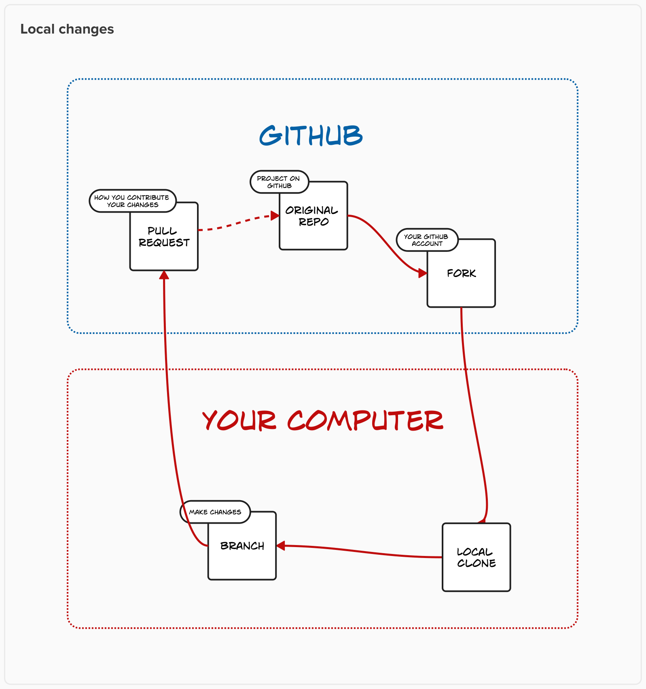

# Git for designers

⚠️ Document status: **Draft**

## Description

The goal of this project is to help those in non-technical (or not *primarily* technical) roles, such as designers, understand and practice the basics of using Git through collaborative editing of documentation. This repo contains text files and associated media, rather than code.

## Main topics to be covered

1. Forking a repo on Github
2. Creating a branch on Github
3. Making changes to a text file using the basic editor
4. Making changes to a text file using VS Code in the browser
5. Committing the changes
6. Opening a pull request to contribute the branch to the original project
7. Syncing your fork’s main branch once the PR is 

## Advanced topics to be covered

1. Cloning a fork to your local machine
2. Choosing and installing an editor
3. Pushing your branch from local to remote

## Maintainer

* [Adrian Cooke](https://github.com/adriancooke)

## Credits

Special thanks to [Daniel Mundra](https://github.com/dmundra) for assistance.