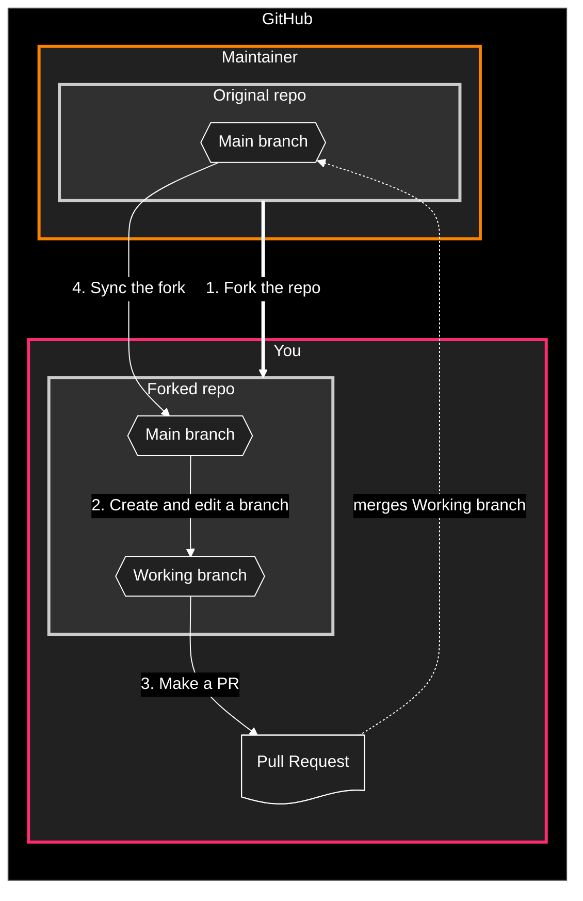
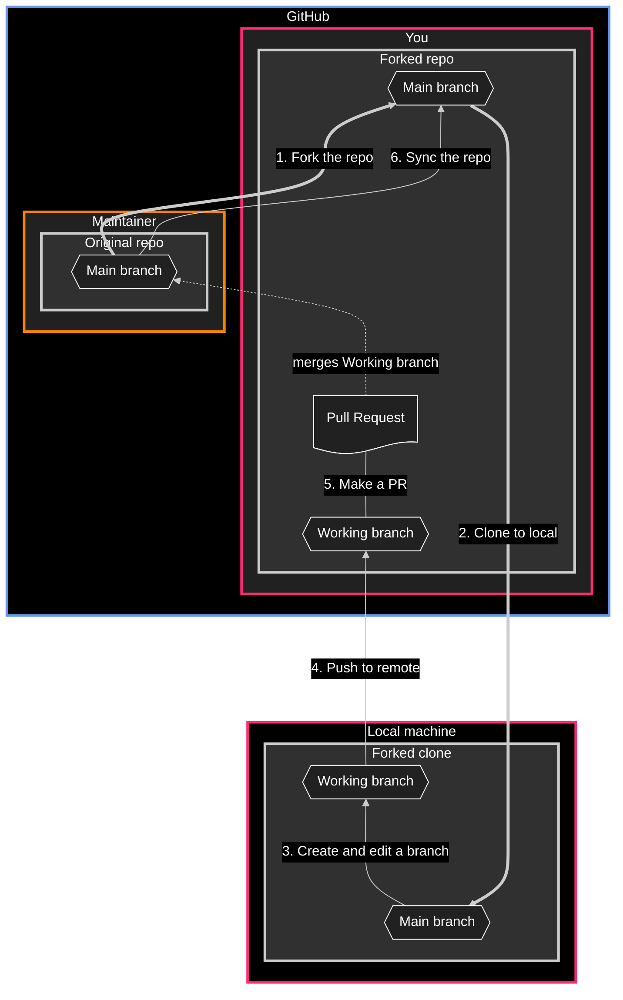

# Git for designers

⚠️ Document status: **Draft**

## Description

The goal of this project is to help those in non-technical (or not *primarily* technical) roles, such as designers, understand and practice the basics of using Git through collaborative editing of documentation. This repo contains text files and associated media, rather than code.

## Main topics to be covered

1. [Forking and branching](docs/1-fork-and-branch.md)
	- Fork an existing repo
	- Create a branch in your forked repo
2. [Editing and committing](docs/2-edit-and-commit.md)
	- Make changes using the basic editor
	- Make changes using the online code editor
3. [Opening a pull request to the original project](docs/3-open-pull-request.md)
4. Syncing your fork once the PR is accepted

### GitHub-only workflow diagram

## Advanced topics

1. Cloning a fork to your local machine
2. Choosing and installing an editor
3. Pushing your branch from local to remote

### Local to GitHub workflow diagram

## Maintainers

* [Adrian Cooke](https://github.com/adriancooke)
* [Daniel Mundra](https://github.com/dmundra)

## Credits

Special thanks to [Daniel Mundra](https://github.com/dmundra) for assistance.
