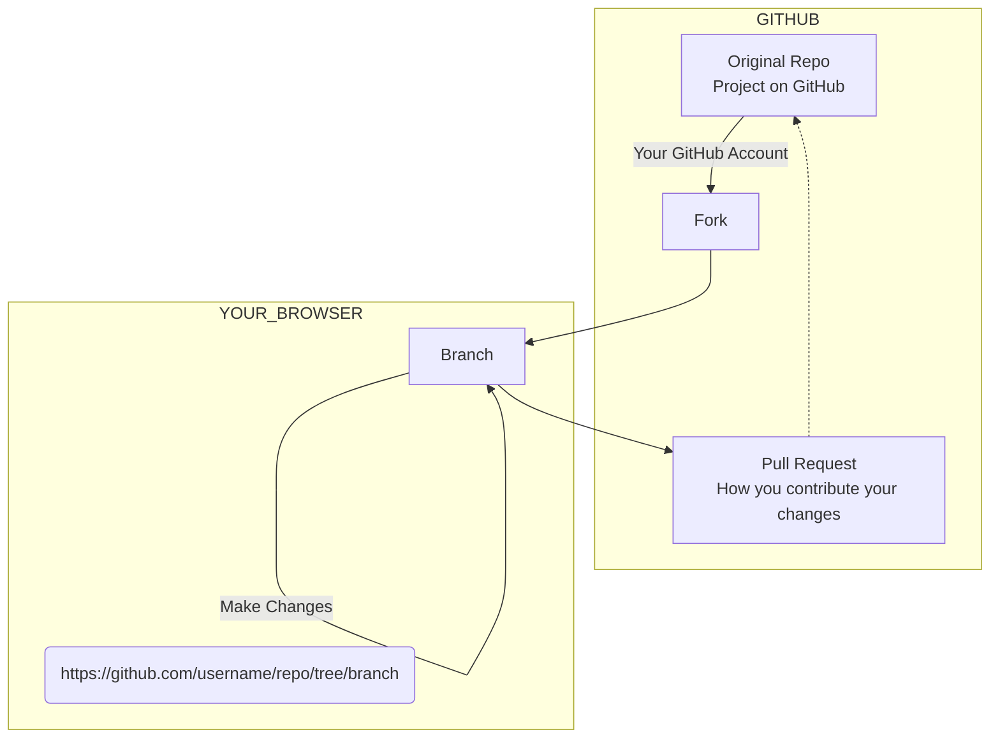
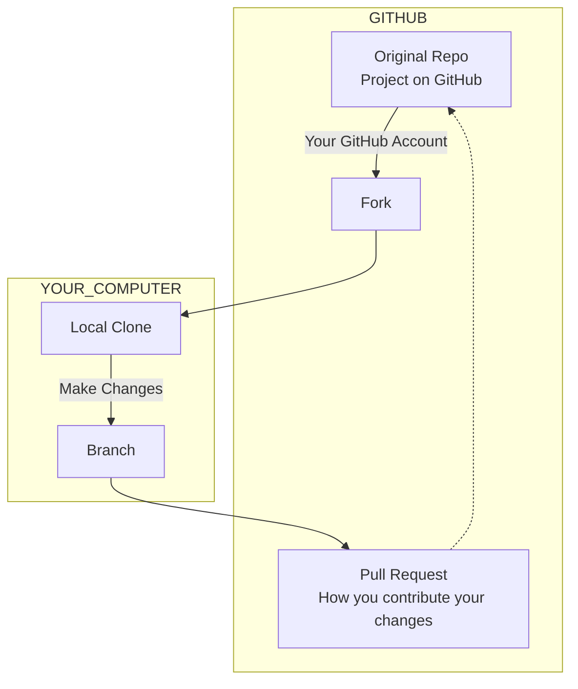

# Git for designers

⚠️ Document status: **Draft**

## Description

The goal of this project is to help those in non-technical (or not *primarily* technical) roles, such as designers, understand and practice the basics of using Git through collaborative editing of documentation. This repo contains text files and associated media, rather than code.

## Main topics to be covered

1. Forking and branching
	- Forking an existing repo
	- Creating a branch in your forked repo
2. Editing files
	- Making changes to a text file using the basic editor
	- Making changes to a text file using VS Code in the browser
3. Committing your changes
4. Opening a pull request to the original project
5. Syncing your fork once the PR is accepted

## Advanced topics

1. Cloning a fork to your local machine
2. Choosing and installing an editor
3. Pushing your branch from local to remote

## Maintainers

* [Adrian Cooke](https://github.com/adriancooke)
* [Daniel Mundra](https://github.com/dmundra)

## Credits

Special thanks to [Daniel Mundra](https://github.com/dmundra) for assistance.
