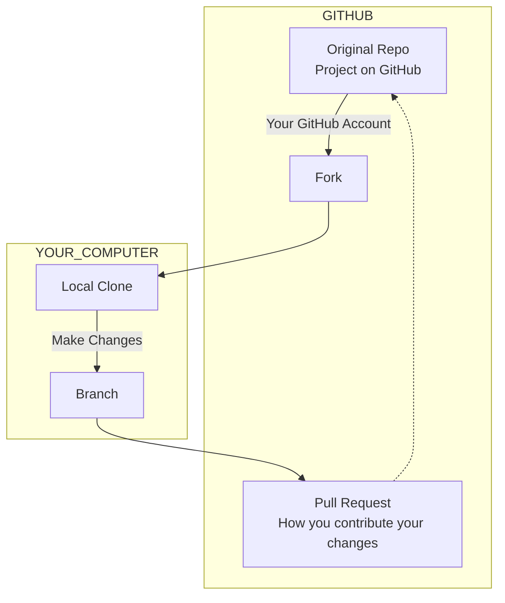

# Git for designers

⚠️ Document status: **Draft**

## Description

The goal of this project is to help those in non-technical (or not *primarily* technical) roles, such as designers, understand and practice the basics of using Git through collaborative editing of documentation. This repo contains text files and associated media, rather than code.

## Main topics to be covered

1. [Forking and branching](docs/1-fork-and-branch.md)
	- Fork an existing repo
	- Create a branch in your forked repo
2. [Editing and committing](docs/2-edit-and-commit.md)
	- Make changes using the basic editor
	- Make changes using the online code editor
3. [Opening a pull request to the original project](docs/3-open-pull-request.md)
4. Syncing your fork once the PR is accepted

```flowchart LR
    style GitHub fill:black
    style Maintainer fill:#212121,stroke-width:3px,stroke:#FA8400
    style You fill:#212121,stroke-width:3px,stroke:#FF2974
    style ORIGINAL fill:#303030,stroke-width:3px,stroke:#CCC
    style FORKED fill:#303030,stroke-width:3px,stroke:#CCC
    subgraph GitHub
        subgraph You
            direction TB
            subgraph FORKED[Forked repo]
                direction TB
                F_MAIN{{Main branch}} -- "2. Create and edit a branch" --> F_BRANCH{{Working branch}}
            end
            F_BRANCH -- "3. Make a PR" --> PR
        end
        subgraph Maintainer
            direction TB
            subgraph ORIGINAL[Original repo]
                O_MAIN{{Main branch}} -- "4. Sync the fork" --> F_MAIN
            end
        end
        ORIGINAL == "1. Fork the repo" ==> FORKED
        PR@{ shape: doc, label: "Pull Request" } -.-> O_MAIN
    end
```

## Advanced topics

1. Cloning a fork to your local machine
2. Choosing and installing an editor
3. Pushing your branch from local to remote



## Maintainers

* [Adrian Cooke](https://github.com/adriancooke)
* [Daniel Mundra](https://github.com/dmundra)

## Credits

Special thanks to [Daniel Mundra](https://github.com/dmundra) for assistance.
